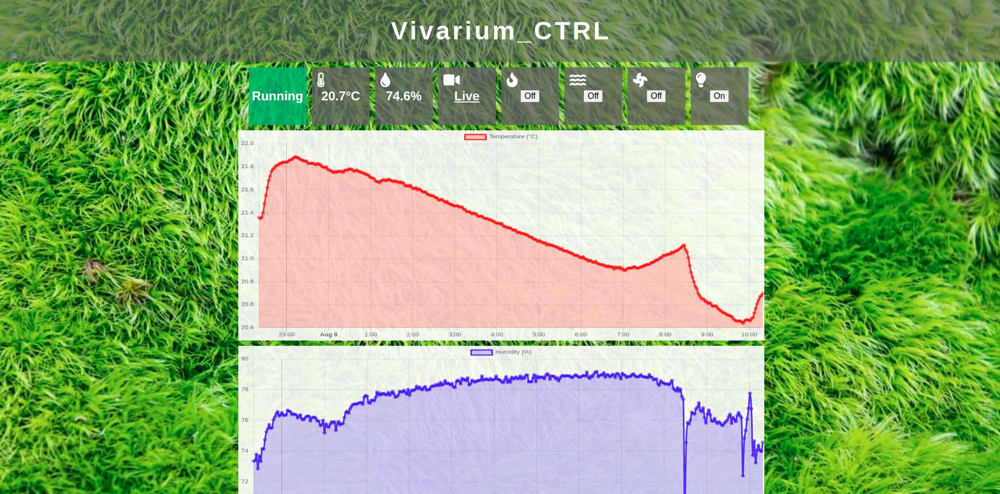
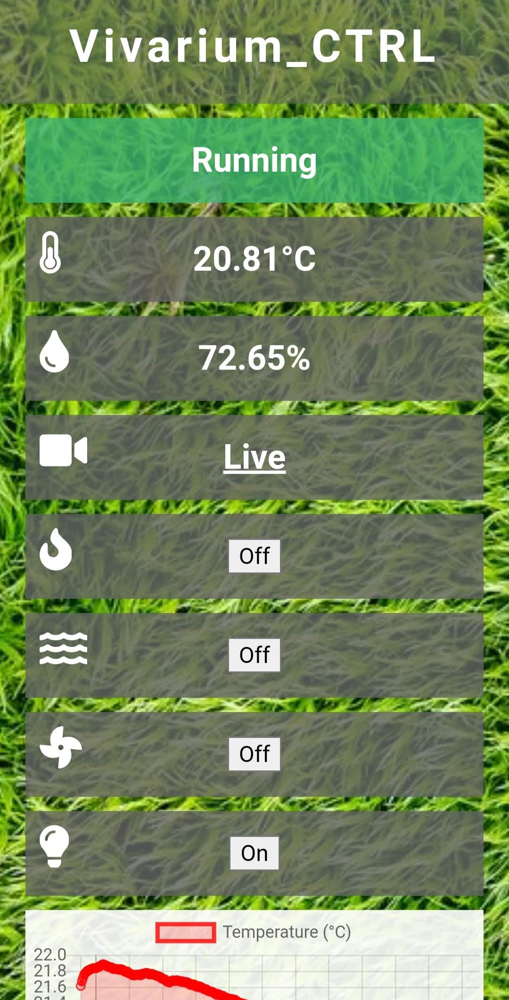

## <p style="text-align:center;">Dedicated to Little Fatso (September 2019 - 23rd December 2024)</p>


This project saw him through his five years, not skipping a beat in maintaining temperature or keeping his lighting to
schedule. His funny little ways will be missed.

---

#  Vivarium_CTRL

**Vivarium monitoring and control using a Raspberry Pi.**

 

Monitor and control a vivarium to ensure its environment remains optimal for the plants and creatures living in it. 
Currently supports:

- Logging of temperature and humidity from a BME280 sensor.
- A live camera stream using any compatible camera.
- Presentation via a webpage with HTTPS and secure login.
- Control up to four devices such as heaters, pumps, fans, etc.
- Automated device control based on time, humidity and temperature.
- Loading as a daemon and logging.
- Daemon status check via webpage.

To install first clone the repo into the root of the pi users home directory and cd into it:

```
git clone https://github.com/danieldean/Vivarium_CTRL.git
cd Vivarium_CTRL
```

Make sure the scripts are still executable using:

```chmod +x vivarium_ctrl.py vivarium_ctrl_web.py```

Copy the service files into the required directory:

```sudo cp *.service /etc/systemd/system/```

Start and enable the services:

```
sudo systemctl start vivarium_ctrl.service
sudo systemctl start vivarium_ctrl_web.service
sudo systemctl enable vivarium_ctrl.service
sudo systemctl enable vivarium_ctrl_web.service
``` 

You also need to add a user before being able to login the the web interface. Assuming you are still in the 
Vivarium_CTRL directory run:

```python3 manage_users.py <username> <password>```

This script can add and remove users as well as change passwords. To see the commands use:

```python3 manage_users.py --help```

If you wish to use HTTPS you need to uncomment the following lines in ```vivarium_ctrl_web.py```:

```
# Use HTTPS
#HTTPServer.ssl_adapter = BuiltinSSLAdapter(
#    certificate=dirname + '/cert/cert.pem',
#    private_key=dirname + '/cert/key.pem'
#)
```

And change the commented out line here:

```
if __name__ == "__main__":
    app.run()
    #web.httpserver.runsimple(app.wsgifunc(), ("0.0.0.0", 8181))
```

Then generate or obtain an SSL Certificate and place them in a folder named 'cert'.

Assuming you have all the hardware setup correctly and the dependencies are installed you should be able to reboot your 
Raspberry Pi and find the web interface running at raspberrypi:8080 for HTTP or raspberrypi:8181 for HTTPS. You can change 
the settings by clicking the the button at the bottom of the homepage.

## Hardware

I am using the following:

- Raspberry Pi Zero WH
- MakerHawk Night Vision IR-Cut FishEye Camera
- WaveShare BME280
- Energenie PiMote
- Energenie Four-way Trailing Gang

Guidance on putting it all together to follow at some stage. However, there is only really one way to have all this 
plugged into the Raspberry Pi at one time so any guide should do. Plug order of the devices plugged into the trailing 
gang can be seen in ```constants.py```.

## Dependencies

You will need to install Adafruit's CircuitPython BME280, webpy, gpiozero and psutil:

```
sudo pip3 install adafruit-circuitpython-bme280
sudo pip3 install webpy
sudo pip3 install gpiozero
sudo pip3 install psutil
```

## Credits

This project contains icons from [Font Awesome](https://fontawesome.com/) licensed under the 
[CC BY 4.0 license](https://creativecommons.org/licenses/by/4.0/) and an image used as the background 
by [Ryan Mandelbaum](https://flic.kr/p/2baRkwQ) licensed under the 
[CC BY 2.0 license](https://creativecommons.org/licenses/by/2.0/).

[Chart.js](https://www.chartjs.org/) and [moment.js](https://momentjs.com/) are used in the production of charts. They 
are licensed under the [MIT license](LICENSE). The files are included rather than fetched as I am likely to run this 
project locally.

Javascript forked from [HTML Table To JSON](https://j.hn/html-table-to-json/) is used to extract data from the sensor 
readings table to enable client side chart creation.

A function called ```is_time_between``` included in ```vivirium_ctrl.py``` is from the accepted answer given by Joe 
Holloway [to this question on Stack Overflow](https://stackoverflow.com/a/10048290), it is licensed under the 
[CC BY-SA 4.0 license](https://creativecommons.org/licenses/by-sa/4.0/).
